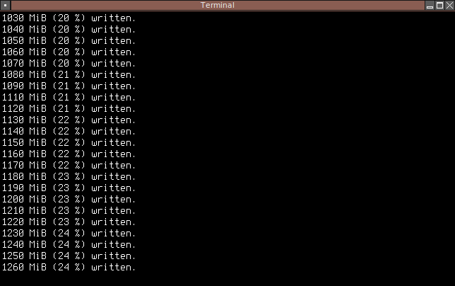

Repository
==========

Dieses Repository enthält alle Versionen von Big, standardmäßig wird im JAR file
aber nur Big4 integriert. Kompilieren erfolgt durch Eingabe von `ant`.

Beschreibung
============

Big ist ein scheinbar sinnloses Programm, mit dem man große Dateien generieren
kann. Was auf den ersten Blick sinnlos erscheint, erschließt sich
bei genauerem Nachdenken: Mit Big kann man schnell Testdateien erzeugen, um
damit z.B. die Geschwindigkeit von Kopier- und Datensicherungsprogrammen zu
vergleichen oder Texteditoren auf ihren Umgang mit großen Dateien testen. Auch
lassen sich eigene Webseiten hiermit auf Spamsicherheit testen, indem man z.B.
1 MB Daten in ein Textfeld eingibt, das auf komplexe Weise ausgewertet werden
muss.

Im Grunde funktionieren alle Big Versionen gleich, Big 2 bietet im Vergleich
zur Vorversion etwas mehr Funktionen, z.B. Zufallsdaten, und arbeitet wesentlich
genauer. Leider waren die beiden Big Versionen 1 und 2 nicht besonders schnell,
weshalb man beim Erzeugen der Daten besser einfach eine 1 MB Datei erzeugte und
diese dann einige Male kopierte, um z.B. einen großen Order zu erstellen.

In Big 3 wurde das Geschwindigkeitsproblem weitgehend behoben. Zwar waren in
Sonderfällen Programme wie `dd` immernoch schneller, dafür konnte man auf ein
einfacheres und plattformunabhängiges Interface zurückgreifen und den
Fortschritt live beobachten.

Big1
====

Big 1 wurde vor allem durch ungenaue Arbeitsweise und schlechte Übersetzung
characterisiert, erfüllte aber seinen eigentlichen Zweck recht gut. Big 1
erzeugte eine sinnlose XML Datei, deren Größe durch die Anzahl der Zeilen
mit dem Inhalt `+++ruibbish+++` gekennzeichnet wurde. Weil für die Bestimmung
der Zeilenanzahl ursprünglich einfach eine Textdatei erstellt wurde, in der
diese Zeile mehrfach kopiert wurde, bis 1 MB erreicht worden war, entstand eine
gewisse Ungenauigkeit.

## Bedienung

Big 1 begrüßte den Nutzer in schlechtem Englisch mit folgender Hilfeseite

	$ java Big
	USAGE :
	java Big <file> <size>
	size : Defines the Size in MB of the rubbish-file to create
	file : Defines the name of the file to create
	
	Tis program makes very big file
	
	Warning :
	THIS PROGRAM IS ONLY FOR TO LEARN NOT TO SPAM SOME OTHERS AS YOU!

Big2
====

Big 2 arbeitete wesentlich genauer als Big 1 und ermöglichte das Erzeugen
von verschiedenen Daten, entweder nur „Null-Bytes“, Zufallstexte oder
zufällige Binärdaten.

## Bedienung

Das Interface hatte sich gegenüber Big1 wesentlich verbessert.

	$ java Big2
	-------------------------------------------------------------------
	 Big 2.0, Copyright (c) Ma_Sys.ma, Further Info : Ma_Sys.ma@gmx.de
	-------------------------------------------------------------------
	
	USAGE : java Big2 <modus> <destination_file> <filesize_mb>
	Avariable Options for <modus> :
	 rtext - <destination_file> is filled with random text
	 zeros - <destination_file> is filled with lots of zeros
	 rbin  - <destination_file> is filled with random bytes
	The output will sent to <destination_file>
	The size of <destination_file> will be <filesize_mb> in MB.
	Enter -1 as filesize for infinite Size, the Program then never exits.
	
	WARNING!
	 This program is only for testing some things with big files.
	 Use it only if you know, what you do. Don't spam people with this program.

Big3
====

Bei Big3 wurde vor allem an der Geschwindigkeit gearbeitet. Das Programm
schrieb die Daten nun in 10 MB Blocks, um Festplattenzugriffe effizienter zu
gestalten. Das Erzeugen von Zufallstexten dauerte wie auch in der Vorversion,
ziemlich lange.

## Bedienung

Das Interface war verglichen zur Vorversion ausgereifter und bot
erstmalig eine andere Einheit als „MiB“, um auch größere Dateien schnell zu
erstellen.

	$ java Big3
	Big 3.0.0.1, Copyright (c) 2011 Ma_Sys.ma.
	For further info send an e-mail to Ma_Sys.ma@web.de.
	
	Usage: java Big3 <method> <file> <size> <unit>
	
	<method>
	   zeros  Writes '0' bytes into <file>.
	   rtext  Writes random text to <file>.
	   rbin   Writes random bytes to <file>.
	<file>
	   The file to write the data to.
	<size>
	   A figure which gives a size.
	<unit>
	   B    Writes <size> bytes to <file>.
	   KiB  Writes <size>*1024 bytes to <file>.
	   MiB  Writes <size>*1024² bytes to <file>.
	   GiB  Writes <size>*1024³ bytes to <file>.

Big4
====

Wie schon beim Vorgänger Big3 wurde auch in dieser Version die Performance
drastisch verbessert. Damit sollte sich Big erstmalig auch zum Benchmarken von
Festplatten einsetzen lassen. Insbesondere die zufallsbasierenden Modi hatten
nun deutlich an Geschwindigkeit zugelegt. Zum Vergleich gibt es unten auch
eine Benchmarktabelle der unterschiedlichen Big-Versionen verglichen mit den
Linux Standardmitteln. In allen diesen Fällen wurden die Daten nach `/dev/null`
geschrieben und die Geschwindigkeit unter Linux mit `pv` ermittelt. Zufallstext
wurde unter Linux mit Hilfe von `cat /dev/urandom | cat -v | pv > /dev/null`
simuliert. Bei Big1 gab es ja keine unterschiedlichen Modi, sodass die
Geschwindigkeit unter „Nullbytes“ angegeben wurde.

Programm  Nullbytes   Zufallstext  Zufallsbytes
--------  ----------  -----------  ------------
Linux     9.5 GiB/s   29 MiB/s     13 MiB/s
Big1      299 MiB/s   n/a          n/a
Big2      15 MiB/s    19 MiB/s     5 MiB/s
Big3      3.7 GiB/s   79 MiB/s     276 MiB/s
Big4      3.8 GiB/s   823 MiB/s    1394 Mib/s

Die starke Beschleunigung bei Big4 wird vor Allem durch die konsequente
Verwendung von mehreren Threads erreicht, sodass Zufallsdaten schneller
generiert werden können. Umgekehrt kommt die getrennte Generierung und Ausgabe
der Daten auch beim Schreiben von Nullbytes zum Einsatz, sodass die nativen
Linux Tools schneller sind.
